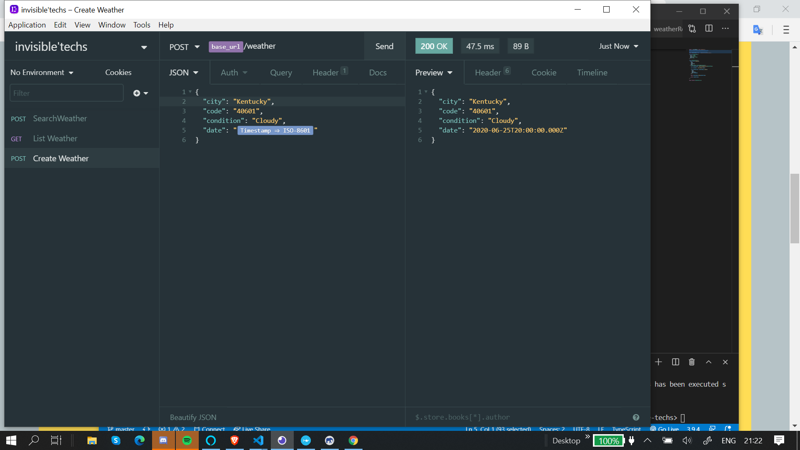
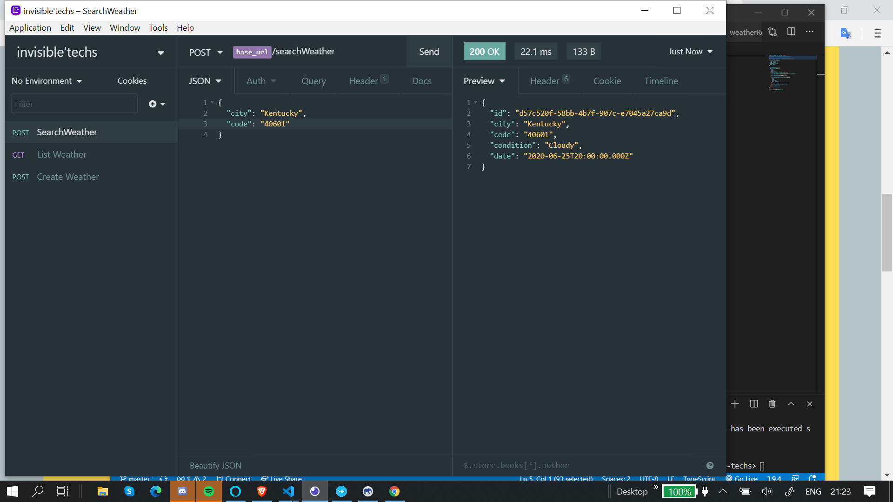

<h1 align="center">
Welcome !
</h1>

  Backend application using Typescript, Appying Repository, service and patterns.

  
  

## Pre Requeriments

- [Node.js] v10.16.3
- [Yarn] v1.19.2

Node.js API built with Express using the best pratices and design patterns.

## Features

- ✅ **Typescript** — Typed superset of JavaScript
- ✅ **Express** — Microframework for Node.js
- ✅ **Lint** — ESlint/Prettier/Editor Config
- ✅ **Uuidv4** — Unic Universal ID creator

## Requisits Chalange 

Given an array of inputs (location name, postal code), log the current time and weather for those locations.

Example: "./weather New York, 10005, Tokyo, São Paulo, Pluto"

Follow our Code guidelines: https://github.com/invisible-tech/guidelines

### Funcionalities. 

Through github I've seen diferent Methods to solve the same problem, most of them using external APIs. I decided to create my own populated database. You can post your own Forecast, List and find them by zip code and city.

* Docker
* Postgress
* TypeOrm

  

## How it works

1. Clone Repository in your machine.
2. Run `yarn` to install dependencies. 
3. Run `yarn dev:server` your server will execute on your localhost:3333.

